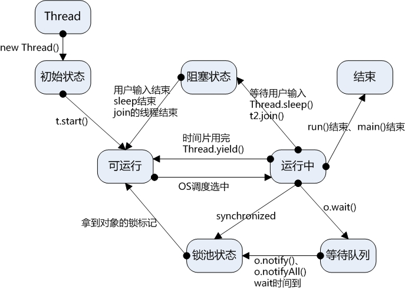

同步：一定要等任务执行完了，得到结果，才执行下一个任务。
异步：不等任务执行完，直接执行下一个任务。


多线程：指的是这个程序（一个进程）运行时产生了不止一个线程
并行与并发：
并行：多个cpu实例或者多台机器同时执行一段处理逻辑，是真正的同时。
并发：通过cpu调度算法，让用户看上去同时执行，实际上从cpu操作层面不是真正的同时。并发往往在场景中有公用的资源，那么针对这个公用的资源往往产生瓶颈，我们会用TPS或者QPS来反应这个系统的处理能力。

线程安全：经常用来描绘一段代码。指在并发的情况之下，该代码经过多线程使用，线程的调度顺序不影响任何结果。这个时候使用多线程，我们只需要关注系统的内存，cpu是不是够用即可。反过来，线程不安全就意味着线程的调度顺序会影响最终结果，如不加事务的转账代码


# 好文
[多线程讲解]](https://blog.csdn.net/evankaka/article/details/44153709)



# join()
在很多情况下，主线程生成并起动了子线程，如果子线程里要进行大量的耗时的运算，主线程往往将于子线程之前结束，但是如果**主线程需要用到子线程的处理结果**，也就是主线程需要等待子线程执行完成之后再结束，这个时候就要用到join()方法了。

# yield
暂停当前正在执行的线程对象，并执行其他线程。

yield()应该做的是让当前运行线程回到可运行状态，以允许具有相同优先级的线程获得运行机会。

- sleep()和yield()的区别

 sleep()和yield()的区别):sleep()使当前线程进入停滞状态，所以执行sleep()的线程在指定的时间内肯定不会被执行；yield()只是使当前线程重新回到可执行状态，所以执行yield()的线程有可能在进入到可执行状态后马上又被执行。

# public final void notify​()
Wakes up a single thread that is waiting on this object's monitor. If any threads are waiting on this object, one of them is chosen to be awakened. The choice is arbitrary and occurs at the discretion of the implementation. **A thread waits on an object's monitor by calling one of the wait methods**.

The awakened thread will not be able to proceed until the current thread relinquishes the lock on this object. The awakened thread will compete in the usual manner with any other threads that might be actively competing to synchronize on this object; for example, the awakened thread enjoys no reliable privilege or disadvantage in being the next thread to lock this object.

This method should only be called by a thread that is the owner of this object's monitor. **A thread becomes the owner of the object's monitor in one of three ways**:

- By executing a **synchronized** instance method of that object.
- By executing the body of a **synchronized** statement that synchronizes on the object.
- For objects of type Class, by executing a **synchronized** static method of that class.


Only one thread at a time can own an object's monitor.

# public final void notifyAll​()
Wakes up all threads that are waiting on this object's monitor. A thread waits on an object's monitor by calling one of the wait methods.
The awakened threads will not be able to proceed until the current thread relinquishes the lock on this object. The awakened threads will compete in the usual manner with any other threads that might be actively competing to synchronize on this object; for example, the awakened threads enjoy no reliable privilege or disadvantage in being the next thread to lock this object.

This method should only be called by a thread that is the owner of this object's monitor. See the notify method for a description of the ways in which a thread can become the owner of a monitor.

Throws:
IllegalMonitorStateException - if the current thread is not the owner of this object's monitor.

# public final void wait​() 
    throws InterruptedException
Causes the **current thread** to wait until another thread invokes the notify() method or the notifyAll() method for **this object**. In other words, this method behaves exactly as if it simply performs the call wait(0).
The current thread must own this object's monitor. The thread releases ownership of this monitor and waits until another thread notifies threads waiting on this object's monitor to wake up either through a call to the notify method or the notifyAll method. The thread then waits until it can re-obtain ownership of the monitor and resumes execution.

As in the one argument version, interrupts and spurious wakeups are possible, and this method should always be used in a loop:

     synchronized (obj) {
         while (<condition does not hold>)
             obj.wait();
         ... // Perform action appropriate to condition
     }
 
This method should only be called by a thread that is the owner of this object's monitor. See the notify method for a description of the ways in which a thread can become the owner of a monitor.

# public final void wait​(long timeout)
                throws InterruptedException
Causes the current thread to wait until either another thread invokes the notify() method or the notifyAll() method for this object, or a specified amount of time has elapsed.
The current thread must own this object's monitor.

This method causes the current thread (call it T) to place itself in the wait set for this object and then to relinquish any and all synchronization claims on this object. Thread T becomes disabled for thread scheduling purposes and lies dormant until one of four things happens:

Some other thread invokes the notify method for this object and thread T happens to be arbitrarily chosen as the thread to be awakened.
Some other thread invokes the notifyAll method for this object.
Some other thread interrupts thread T.
The specified amount of real time has elapsed, more or less. If timeout is zero, however, then real time is not taken into consideration and the thread simply waits until notified.
The thread T is then removed from the wait set for this object and re-enabled for thread scheduling. It then competes in the usual manner with other threads for the right to synchronize on the object; once it has gained control of the object, all its synchronization claims on the object are restored to the status quo ante - that is, to the situation as of the time that the wait method was invoked. Thread T then returns from the invocation of the wait method. Thus, on return from the wait method, the synchronization state of the object and of thread T is exactly as it was when the wait method was invoked.
A thread can also wake up without being notified, interrupted, or timing out, a so-called spurious wakeup. While this will rarely occur in practice, applications must guard against it by testing for the condition that should have caused the thread to be awakened, and continuing to wait if the condition is not satisfied. In other words, waits should always occur in loops, like this one:
```java
synchronized (obj) {
   while (<condition does not hold>)
       obj.wait(timeout);
   ... // Perform action appropriate to condition
}
```
(For more information on this topic, see section 14.2, Condition Queues, in Brian Goetz and others' "Java Concurrency in Practice" (Addison-Wesley, 2006) or Item 69 in Joshua Bloch's "Effective Java (Second Edition)" (Addison-Wesley, 2008).
If the current thread is interrupted by any thread before or while it is waiting, then an InterruptedException is thrown. This exception is not thrown until the lock status of this object has been restored as described above.

Note that the wait method, as it places the current thread into the wait set for this object, unlocks only this object; any other objects on which the current thread may be synchronized remain locked while the thread waits.

This method should only be called by a thread that is the owner of this object's monitor. See the notify method for a description of the ways in which a thread can become the owner of a monitor.

Parameters:
timeout - the maximum time to wait in milliseconds.

# public final void wait​(long timeout,                       int nanos)                throws InterruptedException
Causes the current thread to wait until another thread invokes the notify() method or the notifyAll() method for this object, or some other thread interrupts the current thread, or a certain amount of real time has elapsed.
This method is similar to the wait method of one argument, but it allows finer control over the amount of time to wait for a notification before giving up. The amount of real time, measured in nanoseconds, is given by:

 1000000*timeout+nanos
In all other respects, this method does the same thing as the method wait(long) of one argument. In particular, wait(0, 0) means the same thing as wait(0).

The current thread must own this object's monitor. The thread releases ownership of this monitor and waits until either of the following two conditions has occurred:

Another thread notifies threads waiting on this object's monitor to wake up either through a call to the notify method or the notifyAll method.
The timeout period, specified by timeout milliseconds plus nanos nanoseconds arguments, has elapsed.
The thread then waits until it can re-obtain ownership of the monitor and resumes execution.

As in the one argument version, interrupts and spurious wakeups are possible, and this method should always be used in a loop:
```java
synchronized (obj) {
   while (<condition does not hold>)
       obj.wait(timeout, nanos);
   ... // Perform action appropriate to condition
}
```
This method should only be called by a thread that is the owner of this object's monitor. See the notify method for a description of the ways in which a thread can become the owner of a monitor.
Parameters:
timeout - the maximum time to wait in milliseconds.
nanos - additional time, in nanoseconds range 0-999999.