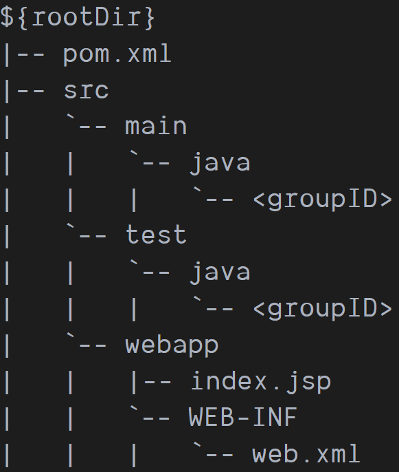

1. generate a quickstart
   in cmd prompt instead of powershell!
   ```cmd
    cd <path-you-want-to-generate>
    mvn archetype:generate -DarchetypeArtifactId="maven-archetype-quickstart" -DarchetypeGroupId="org.apache.maven.archetypes" -DarchetypeCatalog=local
   ```
   which `-DarchetypeCatalog=local`'s prerequisite  is a `archetype-catalog.xml` file in local repository.
   the file can download from [archetype-catalog.xml](https://github.com/JoeyRxy/code/blob/master/Java/archetype-catalog.xml)

2. add external jar to local repository
   get the jar.
   in cmd instead of powershell
   ```cmd
    cd <path-to-jar>
    mvn install:install-file -Dfile=<path-to-file> -DgroupId=<group-id> -DartifactId=<artifact-id> -Dversion=<version> -Dpackaging=<packaging-e.g.:jar>
   ```
   after install to repository,add the dependency to `pom.xml`'s `dependencies`
   ```xml
   <dependency>
      <groupId>groupId</groupId>
      <artifactId>artifactId</artifactId>
      <version>version</version>
    </dependency>
   ```

3. download sources and javadocs

  in the java-project:
   ```cmd
   mvn dependency:sources
   mvn dependency:resolve -Dclassifier=javadoc
   ```

   if these files are not uploaded by the author to the repository,then there will promot:
   
4. main class:
   
   in `pom`:
   ```xml
      <plugin>
        <groupId>org.apache.maven.plugins</groupId>
        <artifactId>maven-jar-plugin</artifactId>
        <version>3.1.2</version>
        <configuration>
          <archive>
            <manifest>
              <mainClass>mine.learn.fft.Main</mainClass>
            </manifest>
          </archive>
        </configuration>
      </plugin>
   ```

5. maven directory structure


文件的根目录为：src, test, webapp   
路径选择时要注意


6. 依赖一同打包
```xml
<plugin>
 <artifactId>maven-assembly-plugin</artifactId>
 <configuration>
   <archive>
     <manifest>
       <mainClass>mine.learn.doubancrawler.App</mainClass>
     </manifest>
   </archive>
   <descriptorRefs>
     <descriptorRef>jar-with-dependencies</descriptorRef>
   </descriptorRefs>
 </configuration>
</plugin>
```
对应的命令不是package，而是assembly:assembly

7. 什么垃圾管理啊？？ 用shade插件必须把<plugins>外的<pluginManagement>去掉，因为这个命令会自动使用默认的插件……

```xml
<build>
    <plugins>
      <plugin>
        <artifactId>maven-compiler-plugin</artifactId>
        <version>3.8.0</version>
      </plugin>
      <plugin>
        <!-- <groupId>org.apache.maven.plugins</groupId> -->
        <artifactId>maven-shade-plugin</artifactId>
        <version>3.2.0</version>
        <executions>
          <execution>
            <phase>package</phase>
            <goals>
              <goal>shade</goal>
            </goals>
            <configuration>
              <shadedArtifactAttached>true</shadedArtifactAttached>
              <shadedClassifierName>project-classifier</shadedClassifierName>
              <outputFile>shade\${project.artifactId}.jar</outputFile>
              <transformers>
                <transformer implementation="org.apache.maven.plugins.shade.resource.ManifestResourceTransformer">
                  <mainClass>Launcher</mainClass>
                </transformer>
              </transformers>
            </configuration>
          </execution>
        </executions>
      </plugin>
    </plugins>
  </build>
```